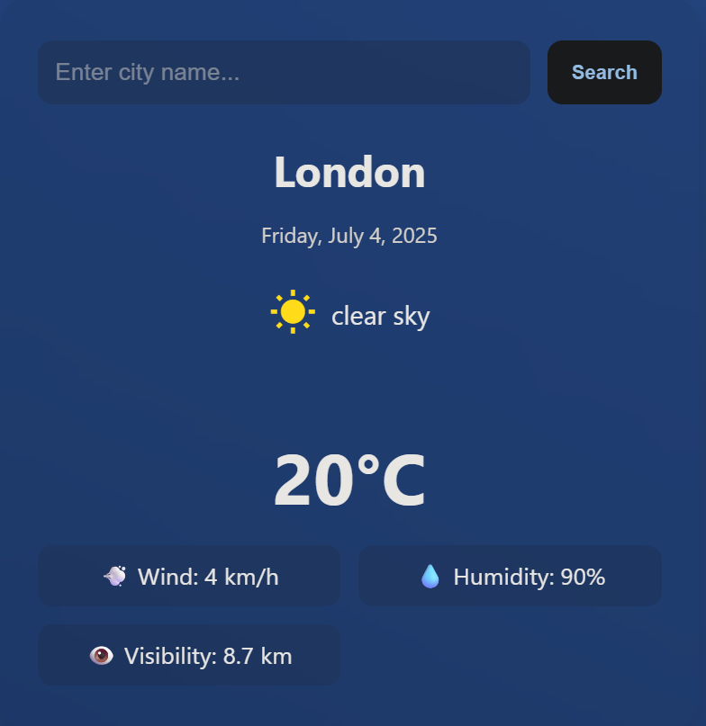

# 🌦️ Weather App Cyberspace

A modern, elegant weather application built using **HTML**, **CSS**, and **JavaScript** with a clean, glassmorphism-inspired UI.

## 📸 Screenshot

## ✨ Features
- Live city-based weather updates
- Temperature, humidity, wind speed, visibility
- Date display
- Weather icons and descriptions
- Responsive design

## 📦 Files Included
- `index.html`
- `style.css`
- `script.js`
- `screenshot.png`
- `README.md`

## 📖 How to Run
1. Download the ZIP
2. Extract it
3. Open `index.html` in your browser

---
💙 Built for cyberspace.